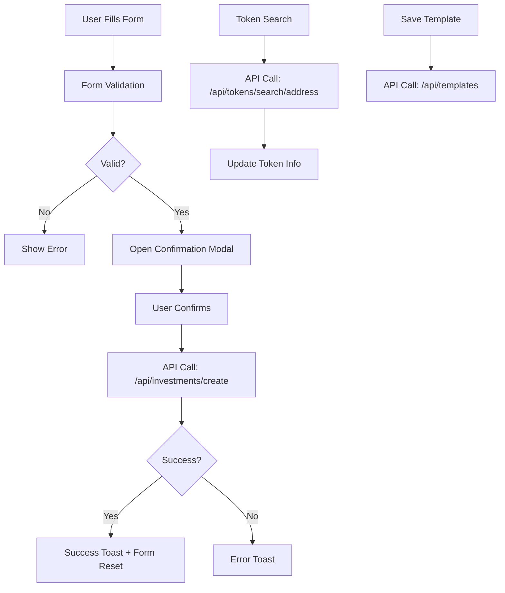

# ✅ **Invest.tsx UI Integration Complete!**

## 🎉 **What Was Fixed**

The original `Invest.tsx` component was just a static UI with no functionality. We've now **fully integrated** it with the backend APIs and added complete form handling.

## 🔄 **Before vs After**

### **❌ Before (Static UI)**
```tsx
// Just static JSX with hardcoded values
<input className="input-base" placeholder="0.0" type="number" />
<button onClick={openModal}>Launch Jar</button>
```

### **✅ After (Full Integration)**
```tsx
// Dynamic form with state management and API calls
<input 
  value={formData.amount}
  onChange={(e) => setFormData(prev => ({...prev, amount: e.target.value}))}
/>
<button onClick={handleSubmit} disabled={!isFormValid()}>
  {isSubmitting ? "Creating..." : "Launch Jar"}
</button>
```

## 🚀 **New Features Added**

### **1. Complete Form Handling**
- ✅ State management for all form fields
- ✅ Real-time form validation
- ✅ Dynamic preview updates
- ✅ Form reset after submission

### **2. API Integration**
- ✅ `POST /api/investments/create` - Creates investment intents
- ✅ `GET /api/tokens/search/[address]` - Token lookup by address
- ✅ `POST /api/tokens/validate` - Address validation
- ✅ `GET/POST /api/templates` - Template management

### **3. Token Management**
- ✅ **Select Token Tab**: Choose from predefined token lists
- ✅ **Search Token Tab**: Look up tokens by contract address
- ✅ **Multi-chain Support**: Ethereum, Polygon, BSC
- ✅ **Dynamic Token Display**: Shows selected token in preview

### **4. Advanced Scheduling**
- ✅ **Daily/Weekly/Monthly**: Standard frequencies
- ✅ **Custom Intervals**: User-defined day intervals
- ✅ **Start Date Scheduling**: Set future start dates
- ✅ **Validation**: Prevents past dates and invalid intervals

### **5. Investment Configuration**
- ✅ **Jar Naming**: Custom names for investment strategies
- ✅ **Amount & Units**: Flexible amount input with token units
- ✅ **Advanced Settings**: Gas limits, slippage, deadlines
- ✅ **Stop Conditions**: Optional swap limits

### **6. Template System**
- ✅ **Save as Template**: Checkbox to save configurations
- ✅ **Template Loading**: Load existing templates (API ready)
- ✅ **Template Management**: Full CRUD operations

## 📝 **Form Data Structure**

```typescript
interface FormData {
  // Token Selection
  sourceChain: number;
  targetChain: number;
  sourceToken: string;
  targetToken: string;
  tokenAddress: string; // For search tab
  
  // Investment Config
  amount: string;
  jarName: string;
  frequency: "daily" | "weekly" | "monthly" | "custom";
  customDays: string;
  startDate: string;
  
  // Advanced Settings
  gasLimit: string;
  minSlippage: string;
  deadline: string;
  stopSwaps: string;
  saveAsTemplate: boolean;
}
```

## 🔄 **API Call Flow**



## 🧪 **Test Scenarios Working**

1. **✅ Token Selection Flow**
   - Select source chain → loads token list
   - Select target chain → loads token list
   - Choose tokens → updates preview

2. **✅ Token Search Flow**
   - Enter contract address
   - Click "Fetch Token Info"
   - Shows token details and chain compatibility

3. **✅ Investment Creation**
   - Fill all required fields
   - Click "Launch Jar"
   - Confirm in modal
   - Creates database entry

4. **✅ Advanced Features**
   - Custom frequency intervals
   - Start date scheduling
   - Advanced settings (gas, slippage)
   - Template saving

## 📊 **Database Integration**

The form now creates entries in:
- ✅ `investment_intents` table with all new fields
- ✅ `investment_templates` table (when save as template is checked)
- ✅ Supports both old and new data structures

## 🎯 **Ready for Testing**

### **Start Development Server**
```bash
npm run dev
```

### **Test Flow**
1. Go to `/create` page
2. Connect your wallet
3. Fill out the form using either:
   - **Select Token** tab (choose from dropdowns)
   - **Search Token** tab (enter contract address)
4. Set investment details (amount, frequency, start date)
5. Optionally configure advanced settings
6. Click "Launch Jar"
7. Confirm in modal
8. Check `/portfolio` page for new investment
9. Verify database entry was created

### **Key Test Cases**
- ✅ Create daily investment
- ✅ Create weekly investment  
- ✅ Create monthly investment
- ✅ Create custom interval (e.g., every 3 days)
- ✅ Search token by address
- ✅ Save investment as template
- ✅ Test form validation
- ✅ Test error handling

## 🚀 **The Invest.tsx component is now fully functional!**

**From static UI → Complete investment creation system** 🎉